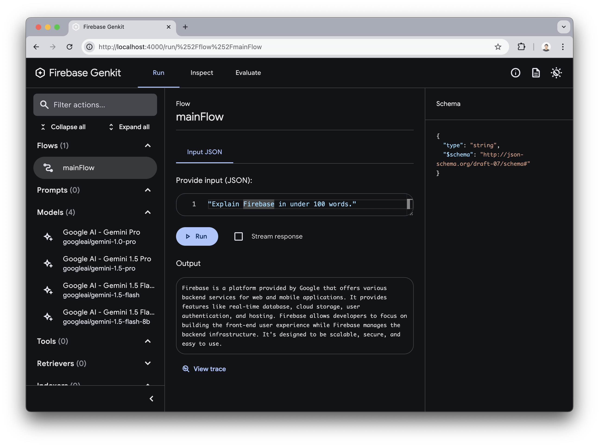
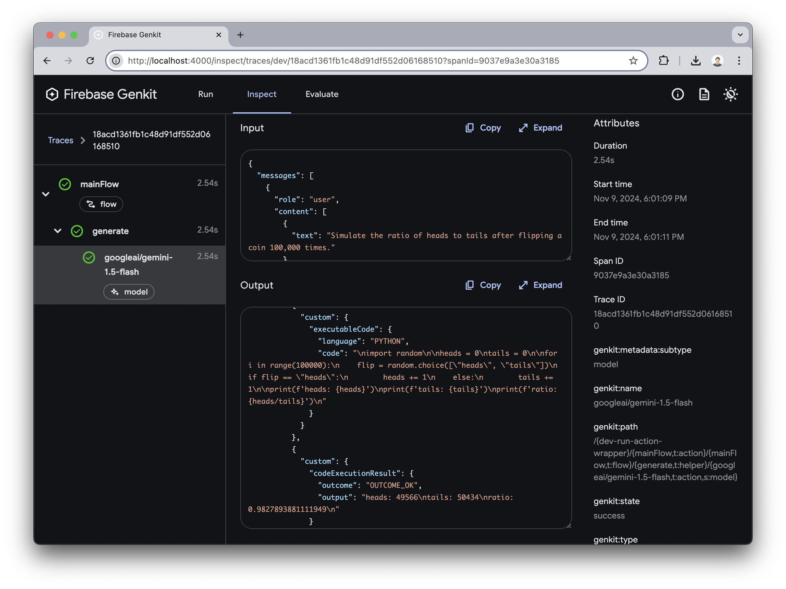
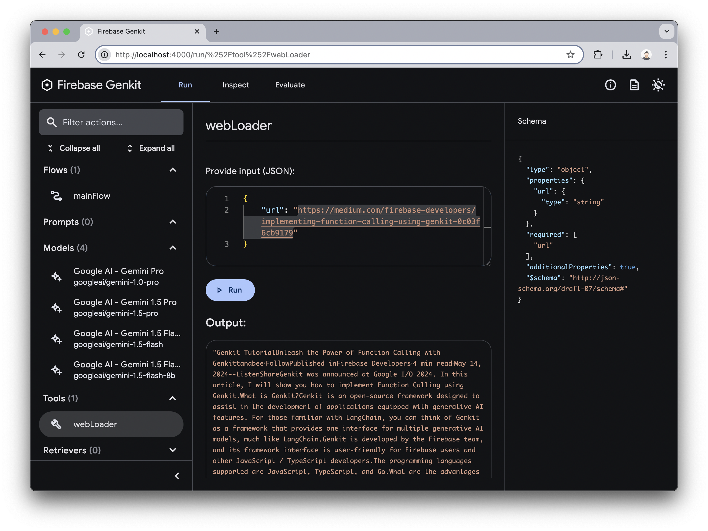
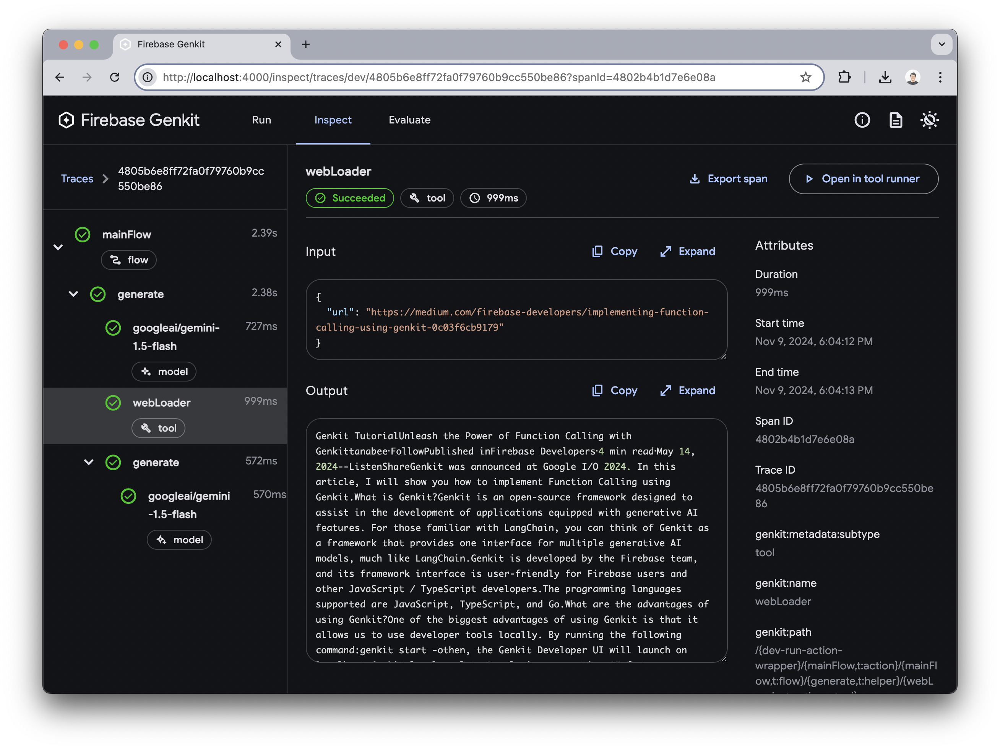
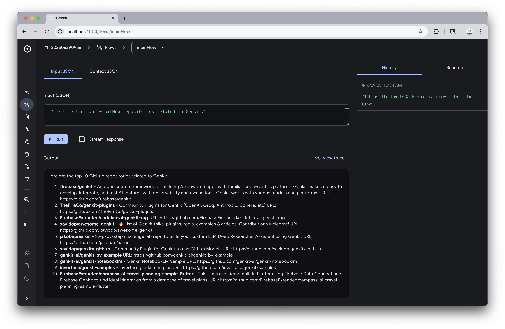
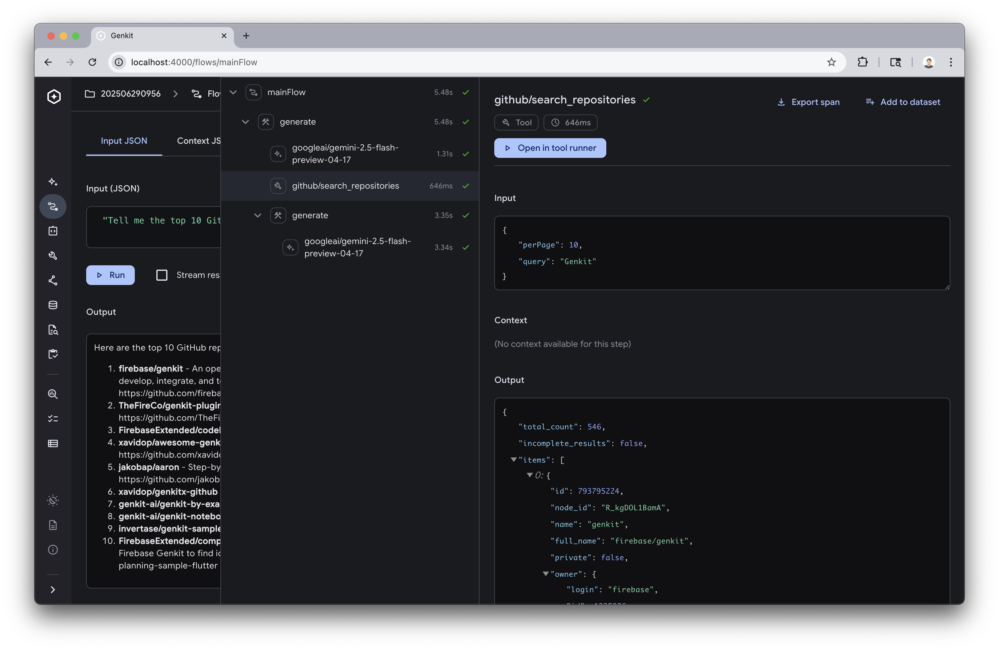

authors: Yuki Tanabe
summary: Genkit Hands-on
id: en
categories: genkit,firebase,javascript
environments: Web
status: Published
url: https://tanabee.github.io/genkit-codelab/en/
analytics_ga4_account: 2P6VCDLG05
feedback_link: https://github.com/tanabee/genkit-codelab/issues

# Genkit Hands-on

## Intro
Duration: 0:01:00

In this codelab, you’ll start with the initial setup of Genkit, then operate features like Code Execution and Function Calling in a local environment. Although it’s very straightforward, this codelab experience will show you how efficiently you can develop using Genkit.

### Prerequisites

- Node.js v20+
- npm

## Get Gemini API key
Duration: 0:02:00

Please access the following site to get the Gemini API key.

* [Get API key | Gemini](https://aistudio.google.com/app/apikey)

As of November 2025, there is a free tier for API keys, and as long as you stay within the scope of this hands-on, you don’t need to worry about any charges.

* [Pricing models | Gemini](https://ai.google.dev/pricing)

Run the following curl command in your terminal, replacing `YOUR_API_KEY` with your actual key, and confirm that a response is successfully returned.

```sh
curl "https://generativelanguage.googleapis.com/v1beta/models/gemini-2.0-flash:generateContent" \
-H 'Content-Type: application/json' \
-H 'X-goog-api-key: YOUR_API_KEY' \
-X POST \
-d '{
  "contents": [
    {
      "parts": [
        {
          "text": "Explain Firebase in under 100 words."
        }
      ]
    }
  ]
}'
```

If you're using Windows, please confirm with the following command on PowerShell.
```PowerShell
(curl `
  -Headers @{"Content-Type"="application/json"} `
  -Body '{"contents":[{"parts":[{"text":"Explain Firebase in under 100 words."}]}]}' `
  -Method POST `
  -Uri 'https://generativelanguage.googleapis.com/v1beta/models/gemini-2.0-flash:generateContent?key=YOUR_API_KEY').Content
```

## Hello Genkit!
Duration: 0:05:00

In this section, we’ll run Genkit locally with its minimal configuration. Run the following commands to initialize the project.

```sh
$ npm create genkitx

? Select template › - Use arrow-keys. Return to submit.
❯   Minimal - This is a Minimal template
    MCP

? Enter your project name › hello-genkit

✅ Project "hello-genkit" has been successfully generated

$ cd hello-genkit
```

Set the Gemini API key you obtained earlier as an environment variable.

```sh
export GEMINI_API_KEY=<your-api-key>
```

If you're using Windows, set the Gemini API key as an environment running the following command on PowerShell.
```PowerShell
$env:GEMINI_API_KEY="<your API key>"
```

Let's check the file src/index.ts. This code represents the actual implementation of a generative AI request using Genkit, which can be written in about 20 lines.

```typescript
import { genkit, z } from 'genkit'
import { googleAI } from '@genkit-ai/googleai'
import { startFlowServer } from '@genkit-ai/express'
import { logger } from 'genkit/logging'
logger.setLogLevel('debug')

const ai = genkit({
  plugins: [googleAI()],
  model: googleAI.model('gemini-2.5-flash-lite', {
    temperature: 0.8,
  }),
})

const mainFlow = ai.defineFlow({
  name: 'mainFlow',
  inputSchema: z.string(),
}, async (input) => {
  const { text } = await ai.generate(input)
  return text
})

startFlowServer({ flows: [mainFlow] })
```

Genkit will start with the following command, and Developer Tools will automatically launch.

```sh
npm start
```

In the Flows menu, select `mainFlow` defined in the code above. Enter a string and select the `Run` button to send a prompt to Gemini.

* Prompt: `Explain Firebase in under 100 words.`



Press the `View trace` button to see detailed Input and Output from the Gemini API.


## Code Execution
Duration: 0:03:00

With Gemini’s Code Execution, you can generate and execute Python code. Only one line needs to be changed.

```typescript
  model: googleAI.model('gemini-2.5-flash-lite', {
    temperature: 0.8,
+   codeExecution: true,
  }),
```

Open Developer Tools, input prompts that require programming into mainFlow, and try the following requests:

* `Simulate the ratio of heads to tails after flipping a coin 100,000 times.`
* `Calculate the 100th Fibonacci number.`
* `Execute the following code in Python: print('Hello World')`

Here is the result.


In the View trace menu, you can see the Python code that was executed.



### Challenge
Try thinking up prompts that require Code Execution and give them a try.

## Function Calling
Duration: 0:05:00

Function Calling allows generative AI to call predefined functions as needed to fulfill user requests. Here are some possible use cases:

* Extracting content from URLs or PDFs included in user requests.
* Calling external APIs, such as:
  * Adding to a calendar
  * Sending notifications to a chat service
  * Searching internal documents
  * Google search

In this codelab, you’ll implement a tool to extract the contents of a URL and try calling it with Function Calling using [Cheerio](https://www.npmjs.com/package/cheerio) as the HTML parser.

```sh
npm i cheerio
```

Remove Code Execution for now.

```typescript
  model: googleAI.model('gemini-2.5-flash-lite', {
    temperature: 0.8,
-   codeExecution: true,
  }),
```

Import cheerio.

```typescript
  import { genkit, z } from 'genkit'
  import { googleAI, gemini25FlashPreview0417 } from '@genkit-ai/googleai'
+ import * as cheerio from 'cheerio'
```

Add the following function under the definition of the `ai` variable in `src/index.ts`. The first argument specifies the tool’s configuration values, and the second argument specifies the process to execute.

```typescript
const webLoader = ai.defineTool(
  {
    name: "webLoader",
    description:
      "When a URL is received, it accesses the URL and retrieves the content inside.",
    inputSchema: z.object({ url: z.string() }),
    outputSchema: z.string(),
  },
  async ({ url }) => {
    const res = await fetch(url)
    const html = await res.text()
    const $ = cheerio.load(html)
    $("script, style, noscript").remove()
    if ($("article")) {
      return $("article").text()
    }
    return $("body").text()
  },
)
```

Specify `tools` in the `generate` method parameter and include `webLoader` in the array. Since `tools` can be specified as an array, you can set multiple tools, and generative AI will select the necessary tool for execution based on the `description` in `defineTool`. Just like prompt engineering, tuning description is essential.

```javascript
-  const { text } = await ai.generate(input)
+  const { text } = await ai.generate({ prompt: input, tools: [webLoader] })
```

The final source code can be found at the following GitHub URL.

[https://github.com/tanabee/genkit-codelab/blob/main/steps/function-calling/src/index.ts](https://github.com/tanabee/genkit-codelab/blob/main/steps/function-calling/src/index.ts)

Now that the code is complete, open Developer Tools. You’ll see that webLoader has been added to the Tools menu. Select webLoader, enter the following URL, and execute it.

URL: [https://firebase.blog/posts/2025/04/genkit-python-go](https://firebase.blog/posts/2025/04/genkit-python-go)



The content of the URL was extracted. In Genkit Developer Tools, you can test tools individually to verify their functionality before incorporating them into a Flow, making development more efficient.

Next, select mainFlow from the Flow menu. Enter the following prompt and execute it.

Prompt: `First, fetch the content inside URL. Next, summarize the content in less than 200 words. https://firebase.blog/posts/2025/04/genkit-python-go`

You can see that the content has been summarized based on the extracted content.


Look at the View trace. You’ll see that while two requests were made to the Gemini API, webLoader was called in between, confirming that the tool was indeed called.



### Challenge

Try defining your own tools and implementing Function Calling.

## Model Context Protocol
Duration: 0:05:00

Model Context Protocol (MCP) is a standardized protocol that allows generative AI applications to securely and efficiently access external data sources and tools. The main difference from Function Calling we experienced earlier is that MCP provides **protocol-level standardization**.

**Function Calling** is a mechanism where developers define and call tools for individual needs. On the other hand, **MCP** is a general-purpose protocol designed to share tools and data sources across different AI models and applications.

The [official MCP GitHub](https://github.com/modelcontextprotocol/servers) lists MCP servers for various services, and by leveraging this ecosystem, you can easily connect to external services.

In this section, we'll use GitHub's MCP server to access GitHub from Genkit.

Create a separate directory from what we've been working with and run `npm create genkitx`. Select `MCP` as the template. The project name is up to you.

```sh
% npm create genkitx

> npx
> create-genkitx

? Select template › - Use arrow-keys. Return to submit.
    Minimal
    VertexAI
❯   MCP - This is a MCP template
    Firebase

? Enter your project name › <your project name>
```

When the project is successfully created, the following message will be displayed. Follow the guide to execute the commands.

※GitHub personal access token can be created at [GitHub Settings](https://github.com/settings/personal-access-tokens).

```sh
✅ Project <your project name> has been successfully generated

You can start your project with the following commands:
cd <your project name>
echo "GEMINI_API_KEY=<your-api-key>" > .env
echo "GITHUB_PERSONAL_ACCESS_TOKEN=<your-github-personal-access-token>" >> .env
npm start
Enjoy building with Genkit! 👍
```

### Source Code

Open `src/index.ts` to see the differences from previous examples.

MCP client definition has been added.

```typescript
const githubClient = createMcpClient({
  name: 'github',
  rawToolResponses: true,
  mcpServer: {
    command: 'npx',
    args: ['-y', '@modelcontextprotocol/server-github'],
    env: process.env as Record<string, string>,
  },
})
```

It retrieves the available MCP tools within the flow and specifies them when making a generative AI request.

```typescript
const mainFlow = ai.defineFlow({
  name: 'mainFlow',
  inputSchema: z.string(),
}, async (prompt) => {
  await githubClient.ready()
  const allTools = await githubClient.getActiveTools(ai)

  const enabledTools = [
    'github-mcp-server/search_repositories',
    'github-mcp-server/search_pull_requests',
    'github-mcp-server/search_issues',
    'github-mcp-server/search_code',
    'github-mcp-server/list_pull_requests',
    'github-mcp-server/list_issues',
    'github-mcp-server/list_commits',
  ]
  const tools = allTools.filter(t => enabledTools.includes(t.__action.name))

  const { text } = await ai.generate({
    prompt,
    tools,
  })

  return text
})
```

With these changes, you can now search repositories on GitHub via MCP.

### Testing

Run `npm start` to launch Developer Tools. Select `mainFlow` from the `Flows` menu and request the generative AI: `Tell me the top 10 GitHub repositories related to Genkit.`

The results are returned.



Select `View trace` to confirm that `github-mcp-server/search_repositories` is being used appropriately.



### Summary

While Function Calling provides high customizability, MCP enables flexible tool sharing through standardization.
MCP's reusability allows you to easily incorporate existing tools, enabling you to focus on developing new features.

### Challenge
If you have time, try other MCP servers (e.g., file system, database) to experience MCP's flexibility.

[modelcontextprotocol/servers](https://github.com/modelcontextprotocol/servers)

## Congrats!
Duration: 0:01:00

This concludes the hands-on session. It’s impressive that so much can be achieved with such little code. Here are some next steps for those who want to dive deeper.

### Next steps

- [High-Precision Responses with Genkit’s Google Search Integration](https://medium.com/firebase-developers/high-precision-responses-with-genkits-google-search-integration-7f142f5c9693)
- [Deploying Your Firebase Genkit Application with Firebase Functions](https://medium.com/@yukinagae/deploying-your-firebase-genkit-application-with-firebase-functions-99c7d0044964)
- [Official Codelab: RAG](https://firebase.google.com/codelabs/ai-genkit-rag)
- [Master Gemma2 and Genkit](https://medium.com/firebase-developers/how-to-develop-using-the-gemma2-model-in-genkit-085f22ce68f3)
- [Build a Slack Bot App with Firebase Genkit in just 100 Lines](https://medium.com/firebase-developers/build-a-slack-bot-app-with-firebase-genkit-in-just-100-lines-71d4e49c9e08)
- [Firebase Genkit for Go Developers: A Guide to Building LLM Applications](https://medium.com/@yukinagae/firebase-genkit-for-go-developers-a-guide-to-building-llm-applications-f96c51c34b10)
- [An open-source Genkit-based internal AI chat implementation](https://medium.com/firebase-developers/internal-ai-a-genkit-based-internal-ai-chat-released-as-open-source-37795896a106)