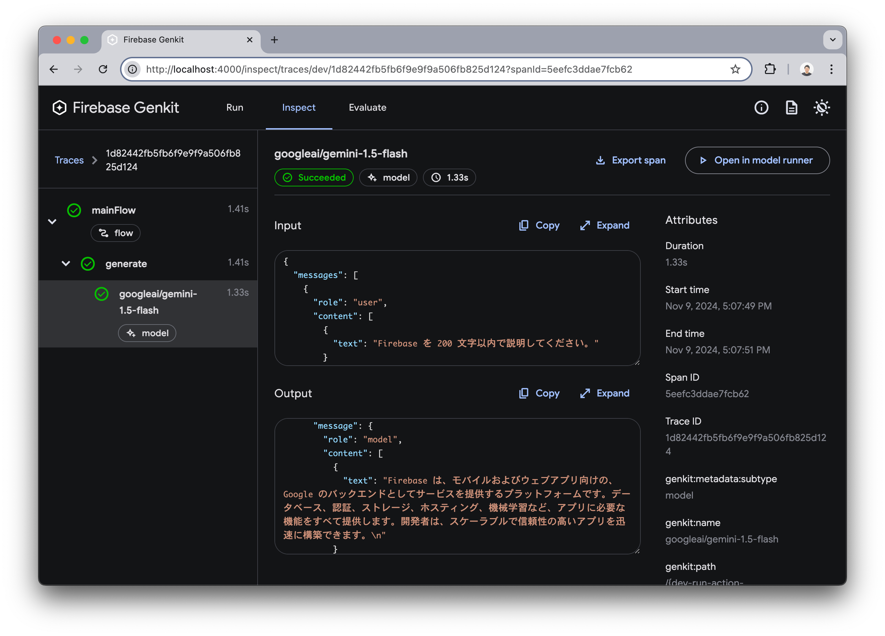
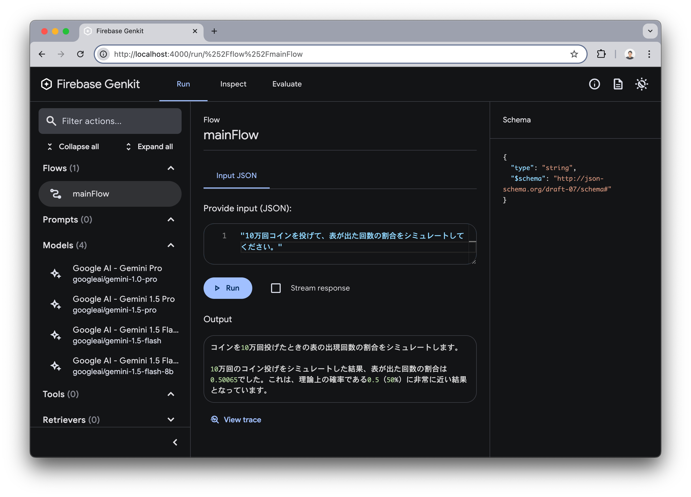
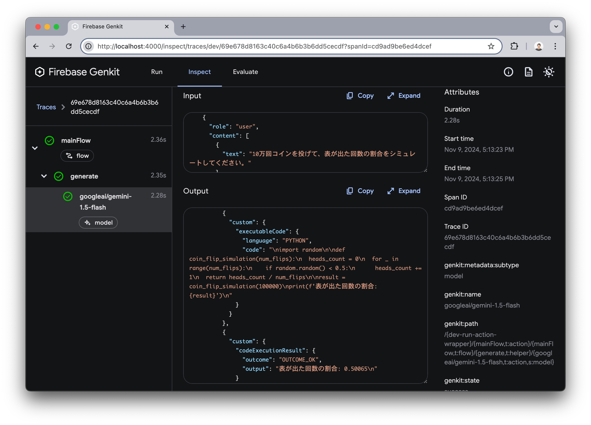
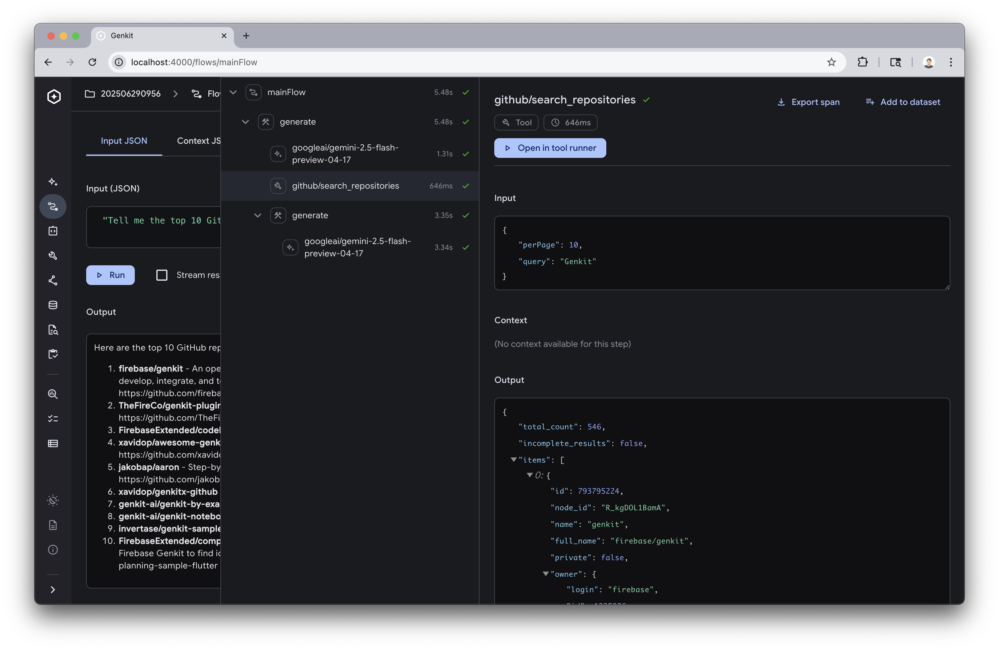

authors: Yuki Tanabe
summary: Genkit Hands-on
id: ja
categories: genkit,firebase,javascript
environments: Web
status: Published
url: https://tanabee.github.io/genkit-codelab/ja/
analytics_ga4_account: 2P6VCDLG05
feedback_link: https://github.com/tanabee/genkit-codelab/issues

# Genkit Hands-on

## Intro
Duration: 0:01:00

このハンズオンでは Genkit の初期セットアップからはじめて、 Code Execution や Function Calling などの機能をローカル環境で動作させます。非常に簡単な内容になっていますが、このハンズオンを通して Genkit を用いた開発がいかに効率的に行えるか体験していただけると思います。

### 前提条件

- Node.js v20+
- npm

## Get Gemini API key
Duration: 0:02:00

以下のサイトにアクセスし、 Gemini の API キーを取得してください。

* [Get API key | Gemini](https://aistudio.google.com/app/apikey)

2025 年 11 月時点において、API キーには無料枠が存在し、ハンズオンを実行する範囲であれば課金の心配はありません。

* [Pricing models | Gemini](https://ai.google.dev/pricing)

ターミナルで以下の curl コマンドを貼り付けて `YOUR_API_KEY` 部分を置き換えて実行してみます。正常にレスポンスが返ってくることを確認しましょう。

```sh
curl "https://generativelanguage.googleapis.com/v1beta/models/gemini-2.0-flash:generateContent" \
-H 'Content-Type: application/json' \
-H 'X-goog-api-key: YOUR_API_KEY' \
-X POST \
-d '{
  "contents": [
    {
      "parts": [
        {
          "text": "Firebase について 200 文字以内で説明してください。"
        }
      ]
    }
  ]
}'
```

Windows の場合は PowerShell 上で以下のコマンドを実行して確認しましょう。
```PowerShell
(curl `
  -Headers @{"Content-Type"="application/json"} `
  -Body '{"contents":[{"parts":[{"text":"Firebase について 200 文字以内で説明してください。"}]}]}' `
  -Method POST `
  -Uri 'https://generativelanguage.googleapis.com/v1beta/models/gemini-2.0-flash:generateContent?key=YOUR_API_KEY').Content
```

## Hello Genkit!
Duration: 0:05:00

以下のコマンドを実行してプロジェクトの初期設定を行います。

```sh
$ npm create genkitx

? Select template › - Use arrow-keys. Return to submit.
❯   Minimal - This is a Minimal template
    MCP

? Enter your project name › hello-genkit

✅ Project "hello-genkit" has been successfully generated

$ cd hello-genkit
```

先ほど取得した Gemini の API キーを環境変数にセットします。

```sh
export GEMINI_API_KEY=<your-api-key>
```

Windows の場合は PowerShell で以下のコマンドを実行し、Gemini の API キーを環境変数にセットします。
```PowerShell
$env:GEMINI_API_KEY="<your API key>"
```

ファイル `src/index.ts` を確認します。このコードが Genkit による生成 AI リクエストの実態となるコードで 20 行程度で書くことができます。

```typescript
import { genkit, z } from 'genkit'
import { googleAI } from '@genkit-ai/googleai'
import { startFlowServer } from '@genkit-ai/express'
import { logger } from 'genkit/logging'
logger.setLogLevel('debug')

const ai = genkit({
  plugins: [googleAI()],
  model: googleAI.model('gemini-2.5-flash-lite', {
    temperature: 0.8,
  }),
})

const mainFlow = ai.defineFlow({
  name: 'mainFlow',
  inputSchema: z.string(),
}, async (input) => {
  const { text } = await ai.generate(input)
  return text
})

startFlowServer({ flows: [mainFlow] })
```

以下のコマンドで Genkit が起動し、 Developer Tools が自動的に立ち上がります。

```sh
npm start
```

Flows メニューから `mainFlow` を選択します。文字列を入力し `Run` ボタンを選択すると Gemini に対してプロンプトを投げることができます。

* プロンプト例: `Firebase を 200 文字以内で説明してください。`


`View trace` ボタンを押すと Gemini API に対する Input, Output を詳細に確認することができます。


## Code Execution
Duration: 0:03:00

Gemini の Code Execution を用いると、 Python コードを生成・実行することが可能になります。コードの変更は 1 行だけです。

```typescript
  model: googleAI.model('gemini-2.5-flash-lite', {
    temperature: 0.8,
+   codeExecution: true,
  }),
```

Developer Tools を開いて `mainFlow` にプログラミングを要するプロンプトを入力しましょう。以下にリクエスト例を挙げます。

* `10 万回コインを投げて、表が出た回数の割合をシミュレートしてください。`
* `フィボナッチ数列の 100 番目の数を計算してください。`
* `Python で以下のコードを実行してください: print('Hello World')`

結果は以下のようになりました。


View trace メニューを見ると実際に実行された Python コードを確認することができます。


### チャレンジ
余裕のある方は Code Execution が必要なプロンプトを考えて実際に試してみましょう。

## Function Calling
Duration: 0:05:00

Function Calling は生成 AI が事前に定義された関数を必要に応じて呼び出し、ユーザーの要求に合致する処理を実行します。例えば以下のようなユースケースがあります。

* ユーザーのリクエストに URL や PDF が含まれている場合、その中身を抽出する。
* 外部 API を呼び出し
  * カレンダー登録
  * チャットサービスへの通知
  * 社内ドキュメント検索
  * Google 検索

このハンズオンでは URL の中身を抽出するツールを実装して Function Calling を体験してもらいます。HTML parser として [Cheerio](https://www.npmjs.com/package/cheerio) を利用します。

```sh
npm i cheerio
```

Code Execution は一度削除しておきます。

```typescript
  model: googleAI.model('gemini-2.5-flash-lite', {
    temperature: 0.8,
-   codeExecution: true,
  }),
```

cheerio を import します。

```typescript
  import { genkit, z } from 'genkit'
  import { googleAI, gemini25FlashPreview0417 } from '@genkit-ai/googleai'
+ import * as cheerio from 'cheerio'
```

src/index.ts の `ai` 変数定義の下に以下の関数を追加します。第一引数に tool の設定値を指定し、第二引数に実行する処理を記載します。

```typescript
const webLoader = ai.defineTool(
  {
    name: "webLoader",
    description:
      "When a URL is received, it accesses the URL and retrieves the content inside.",
    inputSchema: z.object({ url: z.string() }),
    outputSchema: z.string(),
  },
  async ({ url }) => {
    const res = await fetch(url)
    const html = await res.text()
    const $ = cheerio.load(html)
    $("script, style, noscript").remove()
    if ($("article")) {
      return $("article").text()
    }
    return $("body").text()
  },
)
```

`generate` メソッドのパラメータに `tools` を指定して、配列の中身に `webLoader` を指定します。 `tools` は配列で指定できるので複数のツールを設定することができます。その中から必要なツールを生成 AI が選択して実行します。必要かどうかの判断は `defineTool` の `description` をもとに行われます。そのためプロンプトエンジニアリングと同様に `description` のチューニングは重要です。

```typescript
-  const { text } = await ai.generate(input)
+  const { text } = await ai.generate({ prompt: input, tools: [webLoader] })
```

最終的なソースコードは以下の GitHub で確認できます。

[https://github.com/tanabee/genkit-codelab/blob/main/steps/function-calling/src/index.ts](https://github.com/tanabee/genkit-codelab/blob/main/steps/function-calling/src/index.ts)

それでは、コードが完成したので Developer Tools を開いてみます。 Tools メニューに webLoader が追加されていることが分かります。 webLoader を選択し、以下の URL を挿入して実行します。

URL: [https://zenn.dev/tanabee/articles/e05f722c7cbc6c](https://zenn.dev/tanabee/articles/e05f722c7cbc6c)


URL の中身のコンテンツを抽出できました。このように Genkit の Deleloper Tools では tool 単体で検証することができます。tool が実際に動作することが分かって Flow に組み込むことができるので効率よく開発を進められます。

次に Flow メニューから mainFlow を選択します。以下のようにプロンプトを入力して実行してみます。

プロンプト: `以下の URL の内容を 200 文字以内で要約してください。https://zenn.dev/tanabee/articles/e05f722c7cbc6c`

抽出された内容をもとに要約されていることが分かります。


View trace を見てみます。すると Gemini API リクエストが 2 回行われている間に webLoader の呼び出しがあり、実際に tool が呼び出されたことが分かります。


### チャレンジ
余裕のある方は自分で tool を定義して Function Calling を実装してみましょう。

## Model Context Protocol
Duration: 0:05:00

Model Context Protocol (MCP) は、生成AIアプリケーションが外部のデータソースやツールに安全かつ効率的にアクセスするための標準化されたプロトコルです。先ほど体験した Function Calling との主な違いは、MCP が**プロトコルレベルでの標準化**を提供する点にあります。

**Function Calling** は、開発者が個別のニーズに対してツールを定義し、呼び出す仕組みです。一方、**MCP** は汎用的なプロトコルで、異なる AI モデルやアプリケーション間でツールやデータソースを共有できるように設計されています。

[MCP の公式 GitHub](https://github.com/modelcontextprotocol/servers) には様々なサービスの MCP サーバーがリストアップされており、このエコシステムを活用することで簡単に外部サービスと接続できます。

このセクションでは、GitHub の MCP サーバーを用いて、Genkit から GitHub にアクセスします。

これまでとは別のディレクトリを作成し、 `npm create genkitx` を実行します。テンプレートは `MCP` を選択します。プロジェクト名は任意です。

```sh
% npm create genkitx

> npx
> create-genkitx

? Select template › - Use arrow-keys. Return to submit.
    Minimal
    VertexAI
❯   MCP - This is a MCP template
    Firebase

? Enter your project name › <your project name>
```

プロジェクトの作成に成功すると以下のメッセージが表示されるので、ガイドの通りに実行します。

※GitHub の personal access token は [GitHub Settings](https://github.com/settings/personal-access-tokens) で作成できます。

```sh
✅ Project <your project name> has been successfully generated

You can start your project with the following commands:
cd <your project name>
echo "GEMINI_API_KEY=<your-api-key>" > .env
echo "GITHUB_PERSONAL_ACCESS_TOKEN=<your-github-personal-access-token>" >> .env
npm start
Enjoy building with Genkit! 👍
```

### ソースコードの確認

`src/index.ts` を開いて、前回までとの違いを確認します。

MCP クライアントの定義が追加されています。

```typescript
const githubClient = createMcpClient({
  name: 'github',
  rawToolResponses: true,
  mcpServer: {
    command: 'npx',
    args: ['-y', '@modelcontextprotocol/server-github'],
    env: process.env as Record<string, string>,
  },
})
```

Flow内で利用可能なMCPツールを取得し、生成AIリクエスト時に指定しています。

```typescript
const mainFlow = ai.defineFlow({
  name: 'mainFlow',
  inputSchema: z.string(),
}, async (prompt) => {
  await githubClient.ready()
  const allTools = await githubClient.getActiveTools(ai)

  const enabledTools = [
    'github-mcp-server/search_repositories',
    'github-mcp-server/search_pull_requests',
    'github-mcp-server/search_issues',
    'github-mcp-server/search_code',
    'github-mcp-server/list_pull_requests',
    'github-mcp-server/list_issues',
    'github-mcp-server/list_commits',
  ]
  const tools = allTools.filter(t => enabledTools.includes(t.__action.name))

  const { text } = await ai.generate({
    prompt,
    tools,
  })

  return text
})
```

以上の変更により、 GitHub に対して MCP 経由でリポジトリ検索できるようになります。

### 動作確認

`npm start` を実行すると、Developer Tools が立ち上がります。 `Flows` メニューから `mainFlow` を選択し、生成 AI に `Tell me the top 10 GitHub repositories related to Genkit.` とリクエストします。

結果が返ってきました。


`View trace` を選択すると `github-mcp-server/search_repositories` が適切に利用されていることが確認できます。



### まとめ

Function Calling は高いカスタマイズ性を提供する一方、MCP は標準化により柔軟なツール共有を実現します。
MCP の再利用性により、既存のツールを簡単に組み込め、新機能の開発に集中できるようになります。

### チャレンジ
余裕のある方は、他のMCPサーバー（例：ファイルシステム、データベース）を試してみて、MCPの柔軟性を体験してみましょう。

[modelcontextprotocol/servers](https://github.com/modelcontextprotocol/servers)

## Congrats!
Duration: 0:01:00

以上でこのハンズオンは終わりです。少量のコードでこれだけのことが実現できるのは素晴らしいことだと思います。もっと深堀りしたい方向けに Next Action を提示しておきます。

### Next steps

- [Google Search を用いた Grounding](https://medium.com/firebase-developers/high-precision-responses-with-genkits-google-search-integration-7f142f5c9693)
- [Firebase Genkit アプリを Functions へ手軽にデプロイする](https://zenn.dev/cureapp/articles/e8f0dd47641bfd)
- [公式 Codelab: RAG](https://firebase.google.com/codelabs/ai-genkit-rag)
- [Genkit を使って Gemma2 をローカル LLM として呼び出す](https://zenn.dev/cureapp/articles/76bf38216ca304)
- [100 行で作る Firebase Genkit の Slack ボットアプリ](https://zenn.dev/cureapp/articles/1abb1ad278bb0b)
- [Goエンジニアのための生成AI - Firebase Genkit入門](https://zenn.dev/yukinagae/articles/4edbd93a675077)
- [社内向け AI チャットの構築](https://zenn.dev/tanabee/articles/1729f53b9a3223)